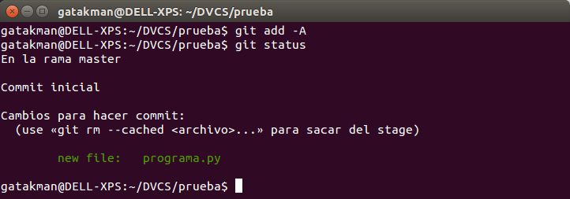
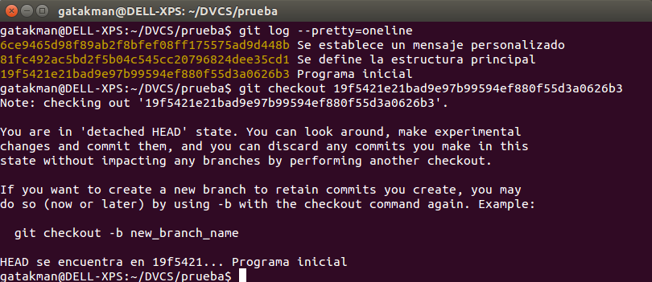

## Actividad 1: El objetivo es crear una cuenta y configurar nuestro equipo con ella

### 1.1.Crear cuenta en github
* Ingresa a la pagina de [https://github.com](https://github.com/)
* Ingresamos nuestros datos en el formulario

* Envía los datos del formulario
* Te llegara un mail a tu cuenta para confirmar el registro, confirmalo!!

### 1.2.Configura la cuenta que creaste en tu equipo
* Abrimos nuestra terminal de comandos (ctrl+t)

* Ingresamos nuestro nombre con el comando:
        git config --global user.name "Juan Galleguillos"
* Ingresamos nuestro mail con el comando:
        git config --global user.email "jgalleguillos@gmail.com"
* Podemos utilizar los comandos sin el ultimo parametro para visualizar la configuración actual.
        git config --global user.name
        git config --global user.email

## Actividad 2: El objetivo es crear nuestro primer repositorio y utilizar los comandos básicos.

### 2.1.Crear carpeta para repositorio e inicializarlo
* Abrimos nuestra terminal de comandos (ctrl+t)

* Creamos una carpeta de nombre "mirepo" para nuestro repositorio:
        mkdir mirepo
* Ingresamos a la carpeta e iniciamos nuestro primer repositorio con el siguiente comando:
        cd mirepo
        git init

### 2.2.Estado del repositorio
* Podemos ver en que estado se encuentra nuestro repositorio con el comando:
        git status
* La terminal nos estrega la siguiente información:

 - La rama en la cual nos encontramos (master por defecto)
 - Si existen cambios en el repositorio
 - En este caso falta un commit inicial

### 2.3.Confirmación inicial
* Primero tenemos que crear un archivo en el área de trabajo (en nuestro caso sera un programa en python el cual puede ser escrito con cualquier editor)
        vim programa.py
* Creamos un programa básico al ingresarle el siguiente código (área de trabajo):
        #!/usr/bin/env python
        # -*- coding: utf-8 -*-

        print('Hola Mundo!!!')
* Guardamos el archivo "programa.py"
* Si verificamos el estado del repositorio, nos daremos cuenta que git ya reconoció el nuevo archivo:
        git status

* Agregamos nuestro programa al área de preparación con el siguiente commando:
        git add -A
* Podemos verificar nuestros cambios en el repositorio (git nos indica esto con un color diferente):

* Confirmamos nuestros cambios y se agraga un comentario con el siguiente comando (se confirman los cambios en el repositorio):
        git commit -m "Programa inicial"
* Verificamos el estado de nuestro repositorio:
        git status
* Git nos informa que no hay cambios, ya que estos fueron confimados:

### 2.4.Confirmaciones realizadas (logs)
* Para ver nuestros commit utilizamos otro comando, el cual se indica a continuación:
        git log

* La imagen anterior nos indica un listado con los commit realizados (en este caso solo el primero), además, nos entrega información importante como:
  - El código identificador del commit (sha-1)
  - El autor del commit (responsable)
  - La fecha y hora de creación
  - El comentario del commit (descripción concisa)
* Ahora realiza cambios al programa y repite el proceso (la idea es que tengas varios commit, al menos 3)
* Si verificamos los commits del repositorio nos deveria salir algo así:

* Finalmente como dato extra podemos visualizar los log personalizados para mejorar la lectura con el siguiente comando:
        git log --pretty=oneline

* Puedes ver mas formatos de visualizacion en la pagina [oficial](https://git-scm.com/docs/pretty-formats).

### 2.5.Muevete entre commits
* Los commit nos permiten movernos entre versiones, para hacer esto, es necesario utilizar el comando:
        git checkout <commit>
* Donde "commit" es el codigo identificador del commit, el cual es el codigo sha-1 que nos muestra `git log`.

* A continuación, muevete entre tus commit y verifica el estado del archivo "programa.py"
* Para volver a tu ultimo commit lo puedes realizar con:
        git checkout master
o también con:
        git checkout <commit>
si es que conoces el id (sha-1) de tu ultimo commit.

### 2.6.Crea otras ramas
* Para ver las ramas que tienes y en la que te encuentras actualmente, utiliza:
        git branch
* El comando anterior nos muestra una lista con las ramas existentes y con un asterisco la rama actual (deveriamos tener solo master).
* Puedes crear otras ramas desde una rama inicial, la cual siempre es master, con el comando:
        git branch <nombre>
en nuestro caso le daremos nombre "desarrollo":
        git branch desarrollo
* Si verificamos nuestras ramas:

### 2.7.Muevete entre ramas
* Las ramas nos permiten movernos entre dimensiones diferentes, cada rama es independiente de la otra hasta que se fusionan.
* Para movernos entre ramas, utilizamos el mismo comando que el para movernos entre commits, con la diferencia que utilizamos el nombre de la rama y no el id de commit, como se muestra a continuación:
        git checkout <nombre_rama>
* Movamonos a la rama "desarrollo" que creamos:
        git checkout desarrollo

* Podemos verificar la rama en la que estamos con:

* Realiza nuevas modificaciones en esta rama y realiza los commits correspondientes (al menos 2), deveria quedar algo asi:
        git log --pretty=online

* Cambiate a la rama master y verifica que no tiene los commits que creaste en la rama desarrollo:

### 2.8.Fusiona las ramas
* Para mover los commits o cambios desde una rama hacia otra tienes que fusionar ramas.
* La fusión funciona desde otra rama hacia la actual, es decir, si nos ubicamos en master, podemos fusionar desde "**desarrollo hacia master**".
* Esto lo realizaremos de la siguiente manera:
        git branch
        git merge desarrollo

* La fusión nos indica que se modificaron 7 lineas, 6 se agregaron y 1 se elimino.
* Verifica el estado de los commits en ambas ramas y te daras cuenta que ahora ambas ramas tienen los mismos commits, ya que fusionaste.

## Actividad 3: El objetivo es clonar un proyecto existente y realizar modificaciones en equipo.

### 3.1.Clona un proyecto existente
* Sal de la carpeta "mirepo", ubicate en la carpeta padre de "mirepo" para clonar un proyecto.
* Dirigete al proyecto [https://github.com/campus-digital/tutorialgit](https://github.com/campus-digital/tutorialgit) y busca el boton clonar:

* Copia la URL y clona con el comando:
        git clone https://github.com/campus-digital/tutorialgit.git
* Nos creara una carpeta llamada "tutorialgit" en donde se encuentra el proyecto clonado, por ende, ingresamos a ella.
* En la Carpeta python se encuentra el programa "operaciones.py" el cual modificaras en equipo.
* Junto a tu compañero selecciona la función que quieres modificar.

### 3.2.Muevete a la rama de tu equipo
* Muevete a la rama con el commando:
        git checkout <branch>
* Realiza modificaciones en la función que seleccionaste y realiza los commits que estimes necesarios.

### 3.3.Fuciona los cambios en master
* Fuciona los cambios en master con el comando ya conocido.

### 3.4.Verifica que master tiene la ultima versión
* Ejecuta el programa y verifica que se encuentren los cambios de todos
