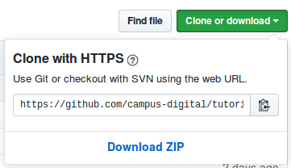

## Actividad 1: El objetivo es crear una cuenta y configurar nuestro equipo con ella.

### 1.1.Crear cuenta en github.

* Ingresa a la pagina de github ([https://github.com](https://github.com/)).
* Ingresa tus datos en el formulario de la web para registrarte, este se muestra en la siguiente imagen:

* Envía los datos del formulario que completaste.
* Te llegara un email a tu cuenta para confirmar el registro, confírmalo!!
* Felicidades, ya estas registrado en github.

### 1.2.Configura la cuenta que creaste en tu equipo.

* Comenzaremos a configurar git en nuestro equipo con la cuenta que creaste en el paso anterior.
* Abrimos nuestra terminal o consola comandos (ctrl+t). Debe ser aimilar a la siguiente imagen:

* Ingresamos nuestro nombre como se indica a continuación:

        git config --global user.name "Juan Galleguillos"
* Ingresamos nuestro mail con el comando:

        git config --global user.email "jgalleguillos@gmail.com"
* Podemos utilizar los comandos sin el ultimo parametro para visualizar los valores ingresados.

        git config --global user.name
        git config --global user.email

## Actividad 2: El objetivo es crear nuestro primer repositorio y utilizar los comandos básicos.

### 2.1.Crear carpeta para repositorio e inicializarlo.

* Abrimos nuestra terminal o consola de comandos (ctrl+t).

* Creamos una carpeta de nombre "mirepo" para nuestro repositorio:

        mkdir mirepo
* Ingresamos a la carpeta e iniciamos nuestro primer repositorio con el comando `git init`, esto lo hacemos de la siguiente manera:

        cd mirepo
        git init
* El comando `git init` es el que inicializa el repositorio.

### 2.2.Estado del repositorio

* Podemos ver en que **estado** se encuentra nuestro repositorio con el comando:

        git status
* Puedes verificar el estado de tu repositorio en cualquier momento con `git status`. 
* La terminal nos entrega la siguiente información:

* Como muestra la imagen anterior, obtenemos:
  - La rama en la cual nos encontramos (master por defecto).
  - Si existen cambios en el repositorio, se visualizaran en diferentes colores, ahora como no tenemos cambios no se aprecian.
  - En este caso falta un commit inicial, el cual siempre es necesario al crear un repositorio.

### 2.3.Confirmación inicial

* Primero tenemos que crear un archivo con el nombre "***programa.py***" en el área de trabajo:

        vim programa.py
    >En nuestro caso sera un programa en python el cual puede ser escrito con cualquier editor de texto

* Creamos un programa básico al ingresarle el siguiente código (área de trabajo):

        #!/usr/bin/env python
        # -*- coding: utf-8 -*-

        print('Hola Mundo!!!')
* Guardamos el archivo editado, en caso de utilizar vim es con:

        :wq
* Si verificamos el estado del repositorio, nos daremos cuenta que git ya reconoció el nuevo archivo:

        git status

    >Como indicamos enteriormente, git reconoce nuestros cambios y los visualiza con colores. En este caso no indica que hay un archivo sin seguimiento y es necesario agregarlo al repositorio.
* Posteriorrmente agregamos nuestro programa al área de preparación con el siguiente comando:

        git add -A
* Podemos verificar nuestros cambios en el repositorio nuevamente con `git status`:

* Confirmamos nuestros cambios y se agrega un comentario con el siguiente comando (se confirman los cambios en el repositorio):

        git commit -m "Programa inicial"
* Verificamos el estado de nuestro repositorio nuevamente:

        git status
* Git nos informa que no hay cambios, ya que estos fueron confirmados:

### 2.4.Confirmaciones realizadas (logs)

* Ahora como visualizamos los commits que hemos realizado ya que `git status` no lo hace.
* Para ver nuestros commit utilizamos el comando `git log`, el cual se indica a continuación:

        git log

* La imagen anterior nos indica un listado con los commit realizados, en este caso solo el primero, además, nos entrega información importante como:
  - El código identificador del commit (sha-1).
  - El autor del commit (responsable).
  - La fecha y hora de la creación.
  - El comentario del commit, el cual se recomienda que sea conciso.
* Ahora realiza otros cambios al programa y repite el proceso (la idea es que realices varios commit, al menos 3).
* Si verificamos los commits del repositorio nuevamente, nos debería salir algo así:

* Finalmente como dato extra podemos visualizar los log personalizados para mejorar la lectura con el siguiente comando:

        git log --pretty=oneline

* Puedes visualizar los logs con mas opciones de visualización, esto lo puedes ver en la pagina [oficial](https://git-scm.com/docs/pretty-formats).

### 2.5.Muevete entre commits

* Para movernos entre commits lo podemos hacer en base a su codigo identificador.
* Para hacer esto, es necesario utilizar el siguiente comando:

        git checkout <idcommit>
* Donde "***idcommit***" es el código identificador del commit, el cual es el codigo sha-1 que nos muestra `git log`.
    >Se puede utilizar una version resumida del codigo identificador, la cual es los primeros 6 caracteres del codigo identificador completo.
* Ahora, muevete a alguno de los commits que tengas en tu repo, que no sea el commit en el que te encuentras, la siguiente imagen ilustra un ejemplo:

* Finalmente vuelve a tu ultimo commit, lo puedes realizar con:

        git checkout master
o también con:

        git checkout <idcommit>
si es que conoces el id (sha-1) de tu ultimo commit. Es importante mencionar que al referirte a la rama, siempre te mueves al ultimo commit.

### 2.6.Crea otras ramas

* Para ver las ramas que tienes y en la que te encuentras actualmente, utiliza:

        git branch
* El comando anterior nos muestra una lista con las ramas existentes y con un asterisco la rama actual (deberíamos tener solo master).

        * master
* Puedes crear otras ramas desde una rama inicial, la cual siempre es master, con el comando:

        git branch <nombre>
en nuestro caso crearemos la rama "desarrollo", lo cual lo realizamos de la siguiente manera:

        git branch desarrollo
* Si verificamos nuestras ramas con `git branch`, deberiamos obtener algo así:

### 2.7.Muevete entre ramas

* Las ramas nos permiten movernos entre dimensiones diferentes, cada rama es independiente de la otra hasta que se fusionan.
* Para movernos entre ramas, utilizamos el mismo comando que el para movernos entre commits, con la diferencia que utilizamos el nombre de la rama y no el id de commit, como se muestra a continuación:

        git checkout <nombre_rama>
* Movámonos a la rama "desarrollo" que creamos:

        git checkout desarrollo

* Podemos verificar la rama en la que estamos con:

* Realiza nuevas modificaciones al "***programa.py***" en esta rama y realiza los commits correspondientes (al menos 2), deberías tener algo así:

        git log --pretty=online

* Cámbiate a la rama master y verifica que no tiene los commits que creaste en la rama desarrollo:

* Con te diste cuenta puedes tomar caminos diferentes segun la rama en la que te encuentres.

### 2.8.Fusiona las ramas.

* Con las ramas, no tan solo puedes crear caminos diferentes, sino que tambien puedes unir caminos.
* Para unir ramas o mover los commits desde una rama hacia otra tienes que fusionar las ramas.
* La fusión funciona ***desde otra rama hacia la actual***, es decir, si nos ubicamos en master, podemos fusionar desde
***desarrollo*** hacia ***master***.
* Esto lo realizaremos de la siguiente manera (recuerda moverte a master):

        git branch
        git merge desarrollo

* La fusión nos indica que se modificaron 7 lineas, 6 se agregaron y 1 se elimino.
* Verifica el estado de los commits en ambas ramas y te darás cuenta que ahora ambas ramas tienen los mismos commits, ya que fusionaste.

## Actividad 3: El objetivo es clonar un proyecto existente y realizar modificaciones en repositorio remoto.

### 3.1.Clona un proyecto existente

* Sal de la carpeta "mirepo", ubícate en la carpeta padre de "mirepo" para clonar un proyecto.
* Dirígete al proyecto [https://github.com/campus-digital/tutorialgit](https://github.com/campus-digital/tutorialgit) y busca clonar:

* Copia la URL y clona con el comando:

        git clone https://github.com/campus-digital/tutorialgit.git
* Nos creara una carpeta llamada "tutorialgit" en donde se encuentra el proyecto clonado, por ende, ingresamos a ella.
* Si ejecutamos `git status` nos reconocerá que estamos en una carpeta de git y nos dará la información correspondiente.
* En la Carpeta python se encuentra el programa "***operaciones.py***" el cual modificaras colaborativamente, revisa su código.
* Ponte deacuerdo con tus compañeros y selecciona una función a modificar.

### 3.2.Muevete a la rama de tu función.

* Muévete a la rama correspondiente a la función que modificaras con el comando:

        git checkout <branch>
* Realiza modificaciones en la función que seleccionaste y realiza los commits que estimes necesarios.

### 3.3.Subir y bajar cambios de repositorio

* Ya conoces los comandos básicos de git para trabajar localmente, sin embargo, para interactuar con un repositorio remoto es necesario conocer algunos mas.
* Para subir tus cambios locales a un repositorio utiliza el comando:

        git push origin <branch>
  >Recuerda que debe ser la misma rama en la que te encuentras y haz realizado modificaciones.
* Ahora cualquier persona puede bajar esos cambios que realizaste en esa rama.
* Intenta cambiarte de rama y bajar los cambios que realizo otra persona y verifica su funcionamiento.
* Para bajar cambios desde un repositorio utiliza el comando:

        git pull origin <branch>
  >Recuerda que debe ser la misma rama en la que te encuentras para evitar conflictos.

### 3.4.Fusiona los cambios en master.

* Fusiona los cambios en master con el comando ya conocido y súbelos al repositorio remoto, con esto quedaran todas las modificaciones en master:

        git checkout master
        git merge <branch>

### 3.5.Verifica que master tiene la ultima versión y sube los cambios.

* Ejecuta el programa y verifica que se encuentren los cambios de todas las ramas en master.
* Si tu rama master funciona sin problemas, sube los cambios:

        git push origin master
